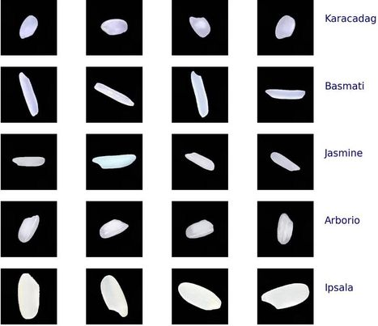

# Rice_Classification_CNN

<h2><b>Summary</b></h2>

Rice is one of the most popular sorghum of the world and this is the main food in Asia meal. To support people easy to classify and choice the favorite type of rice for their family, i aim to build the mini trial model, which help to detect 5 rices, include: Karacadag, Basmati, Jasmine, Arborio and Ipsala.

There are the sample image for all type of rice in this project:
 

 

<h2><b>Conclusion</b></h2>

I choose CNN model in PyTorch to this classification task. In conclusion, my model return F1 score 0.98, i believe that this is the highly metrics, which make sure our model can predict the true label in many situation.

Beside that, this is the final confusion matrix:

 

